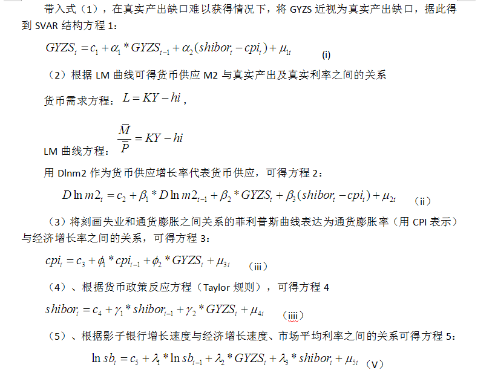

本程序描述在R中对影子银行建模，并对模型进行分析和研究。

首先加载需要用到的R包。R包是一些工具的集合，方便重复使用。

这个包可以读取Excel表格文件。
```{r message=FALSE}
library(gdata)
```
这个包有工具函数处理时间序列。
```{r message=FALSE}
library(TTR)
```
这个包可以进行单位根检验。
```{r message=FALSE}
library(fUnitRoots)
library(urca)
```
这个包可以进行ARIMA建模。
```{r message=FALSE}
library(forecast)
```
这个包做Engle-Granger测试。
```{r message=FALSE}
library(egcm)
```
这个包做Granger因果检验。
```{r message=FALSE}
library(vars)
```
这个包有工具处理时间序列。
```{r message=FALSE}
library(xts)
library(tseries)
#library(mts)
```
这个包方便输出内容。
```{r message=FALSE}
library(knitr)
```
首先读取xls文件，文件中包含了可能影响影子银行的各种因素，接下来我们会基于这些数据建立影子银行的模型。文件的最开始两行是文件头，说明了每个列的名字，跳过最开始的两行。
```{r message=FALSE, cache=TRUE}
# raw_data <- read.xls("data.xls", sheet = 1, skip=2)
# raw_data <- read.xls("quater.xls", sheet = 1)
raw_data <- read.xls("quater_v2.xls", sheet = 1, skip=1)
```
文件中有一些列是隐藏的，但是R会把隐藏的列也读出来，因此我们重新设置列的名字，方便后面读取列。
第一列是对应年月改名为MONTH，第二列是用X12加法季节性调整后的LNSB，第三列是X12（乘法）季节性调整后的DLNM2，第四列是规模以上工业企业增加值当月同比实际增速，第五列是CPI指数，第六列是当月银行间同业拆借加权平均利率
```{r message=FALSE}
# colnames(raw_data) = c("MONTH", "X", "X.1", "LNSB", "X.2", "X.3", "X.4", "DLNM2", "GYZS", "CPI", "SHIBOR")
# colnames(raw_data) = c("DLNM2", "LNSB", "DLNGDP", "CPI", "SHIBOR", "X")
colnames(raw_data) = c("QT", "RGDP", "RM2", "RSB", "RCPI", "RSHIBOR")
```
将第一列转换为日期，默认是字符。转换为日期后可以用于后面创建时间序列。
```{r message=FALSE}
# raw_data <- read.zoo(raw_data, FUN=as.yearqtr)
raw_data <- raw_data[c("RSB", "RGDP", "RM2", "RCPI", "RSHIBOR")]
```
数据的图形表示。
```{r message=FALSE}
# n <- c("LNSB", "DLNM2", "GYZS", "CPI", "SHIBOR")
# for (c in n) {
#         plot.xts(raw_data[, c])
# }
```

数据的描述性统计特性。
```{r message=FALSE}
# kable(summary(raw_data))
```

创建表格用于存储每个变量的平稳性检验的结果。我们会对变量以及变量的一阶差分做ADF检验。
```{r message=FALSE}
# var_adf_test_result <- data.frame(name=c("LNSB", "DLNM2", "GYZS", "CPI", "SHIBOR"),
#                                   adf=rep(0, 5),
#                                   diff_adf=rep(0, 5),
#                                   type=c("(c, 0, 0)", "(c, 0, 0)", "(c, 0, 0)", "(c, 0, 0)", "(c, 0, 0)"),
#                                   result=c("0 (0)", "0 (0)", "0 (0)", "0 (0)", "0 (0)"),
#                                   stringsAsFactors=FALSE)
```
对LNSB变量进行平稳性检验。创建该变量的时间序列。并且对该时间序列进行adf检测，允许常数，不允许时间趋势，并且没有滞后期阶数。
```{r message=FALSE, warning=FALSE}
# series <- as.ts(raw_data[, "LNSB"])
# result <- adfTest(series, type = "c")

```
```{r}
# show(result)
# lnsb.df <- ur.df(as.vector(raw_data[, "LNSB"]))
# summary(lnsb.df)
```
对LNSB的一阶差分序列做同样的检验。
```{r message=FALSE, warning=FALSE}
# diff_series <- diff(series, lag=1)
# diff_result <- adfTest(diff_series, type = "c")
# hypothesis = paste(ifelse(result@test$p.value <= 0.05, "1", "0"),
#                 ifelse(diff_result@test$p.value <= 0.05, "(1)", "(0)"),
#                 sep=" ")
```
保存结果。
```{r message=FALSE}
# var_adf_test_result[1, c("adf", "diff_adf", "result")] <- c(result@test$statistic, diff_result@test$statistic, hypothesis)
```
检验DLNM2
```{r message=FALSE, warning=FALSE}
# series <- as.ts(raw_data[, "DLNM2"])
# result <- adfTest(series, type = "c")
# diff_series <- diff(series, lag=1)
# diff_result <- adfTest(diff_series, type = "c")
# hypothesis = paste(ifelse(result@test$p.value <= 0.05, "1", "0"),
#                 ifelse(diff_result@test$p.value <= 0.05, "(1)", "(0)"),
#                 sep=" ")
# var_adf_test_result[2, c("adf", "diff_adf", "result")] <- c(result@test$statistic, diff_result@test$statistic, hypothesis)
```
检验GYZS
```{r message=FALSE, warning=FALSE}
# series <- as.ts(raw_data[, "GYZS"])
# result <- adfTest(series, type = "c")
# diff_series <- diff(series, lag=1)
# diff_result <- adfTest(diff_series, type = "c")
# hypothesis = paste(ifelse(result@test$p.value <= 0.05, "1", "0"),
#                 ifelse(diff_result@test$p.value <= 0.05, "(1)", "(0)"),
#                 sep=" ")
# var_adf_test_result[3, c("adf", "diff_adf", "result")] <- c(result@test$statistic, diff_result@test$statistic, hypothesis)
```

检验CPI
```{r message=FALSE, warning=FALSE}
# series <- as.ts(raw_data[, "CPI"])
# result <- adfTest(series, type = "c")
# diff_series <- diff(series, lag=1)
# diff_result <- adfTest(diff_series, type = "c")
# hypothesis = paste(ifelse(result@test$p.value <= 0.05, "1", "0"),
#                 ifelse(diff_result@test$p.value <= 0.05, "(1)", "(0)"),
#                 sep=" ")
# var_adf_test_result[4, c("adf", "diff_adf", "result")] <- c(result@test$statistic, diff_result@test$statistic, hypothesis)
```
检验SHIBOR
```{r message=FALSE, warning=FALSE}
# series <- as.ts(raw_data[, "SHIBOR"])
# result <- adfTest(series, type = "c")
# diff_series <- diff(series, lag=1)
# diff_result <- adfTest(diff_series, type = "c")
# hypothesis = paste(ifelse(result@test$p.value <= 0.05, "1", "0"),
#                 ifelse(diff_result@test$p.value <= 0.05, "(1)", "(0)"),
#                 sep=" ")
# var_adf_test_result[5, c("adf", "diff_adf", "result")] <- c(result@test$statistic, diff_result@test$statistic, hypothesis)
```
这是对所有变量进行平稳性分析后的结果，显著性水平设置为5%。
```{r echo=FALSE}
# colnames(var_adf_test_result) = c("变量", "ADF检验值", "一阶差分ADF检验值", "检验类型", "结论")
```
```{r message=FALSE}
# kable(var_adf_test_result, digits=4)
```

```{r}
# raw_data_names = c("LNSB", "DLNM2", "GYZS", "CPI", "SHIBOR")
# for (name in raw_data_names) {
#         # series <- as.ts(raw_data[, name])
#         # result <- adfTest(series, type = "c")
#         # diff_series <- diff(series, lag=1)
#         # diff_result <- adfTest(diff_series, type = "c")
#         series <- as.vector(raw_data[, name])
#         result <- adf.test(series)
#         print(result)
#         diff_series <- diff(series, lag=1)
#         diff_result <- adf.test(diff_series)
#         print(diff_result)
# }
```

下面我们对变量LNSB,和其他变量进行协整检验。
```{r message=FALSE}
# plot(egcm(as.vector(raw_data[, "LNSB"]), as.vector(raw_data[, "DLNM2"])))
# plot(egcm(as.vector(raw_data[, "LNSB"]), as.vector(raw_data[, "GYZS"])))
# plot(egcm(as.vector(raw_data[, "LNSB"]), as.vector(raw_data[, "CPI"])))
# plot(egcm(as.vector(raw_data[, "LNSB"]), as.vector(raw_data[, "SHIBOR"])))
```

对变量DLNM2和其他变量进行协整检验。
```{r message=FALSE}
# plot(egcm(as.vector(raw_data[, "DLNM2"]), as.vector(raw_data[, "GYZS"])))
# plot(egcm(as.vector(raw_data[, "DLNM2"]), as.vector(raw_data[, "CPI"])))
# plot(egcm(as.vector(raw_data[, "DLNM2"]), as.vector(raw_data[, "SHIBOR"])))
```

对变量GYZS和其他变量进行协整检验。
```{r message=FALSE}
# plot(egcm(as.vector(raw_data[, "GYZS"]), as.vector(raw_data[, "CPI"])))
# plot(egcm(as.vector(raw_data[, "GYZS"]), as.vector(raw_data[, "SHIBOR"])))
```

对变量CPI和其他变量进行协整检验。
```{r message=FALSE}
# plot(egcm(as.vector(raw_data[, "CPI"]), as.vector(raw_data[, "SHIBOR"])))
# raw_data_colnames <- colnames(raw_data)
# for (first in raw_data_colnames) {
#   for (second in raw_data_colnames) {
#     if (first != second) {
#        result <- egcm(as.vector(raw_data[, first]), as.vector(raw_data[, second]))
#        print(is.cointegrated(result))
#     }
#   }
# }
```

下面对任意两个变量之间做因果检验。
```{r message=FALSE}
# names <- c("LNSB", "DLNM2", "GYZS", "CPI", "SHIBOR")
# for (f in names) {
#         for (t in names) {
#                 if (f != t) {
#                         v <- VAR(raw_data[, c(f, t)])
#                         result <- causality(v, cause=t)
#                         print(result)
#                 }
#         }
# }
```

我们用自动的方法来选择最优的滞后阶数。
```{r message=TRUE}
VARselect(as.matrix(raw_data), lag.max = 8, type = "both")
```

从表中的输出可以看出按照AIC和FPE标准，最优的滞后阶数是2，按照HQ和SC的标准，最优的阶数是1。不妨按照2来对每个变量做ADF测试。
```{r}
# lnsb.df <- summary(ur.df(as.vector(raw_data[, "LNSB"]), type="drift", lags=1))
# lnsb.df
# 
# diff_lnsb.df <- summary(ur.df(as.vector(diff(raw_data[, "LNSB"])), type="drift", lags=1))
# diff_lnsb.df
```

```{r}
#summary(ur.df(as.vector(raw_data[, "DLMN2"]), type="trend", lags=2))
```

```{r}
#summary(ur.df(as.vector(raw_data[, "GYZS"]), type="trend", lags=2))
```

```{r}
#summary(ur.df(as.vector(raw_data[, "CPI"]), type="trend", lags=2))
```

```{r}
#summary(ur.df(as.vector(raw_data[, "SHIBOR"]), type="trend", lags=2))
```


<!---->

下面我们来建立影子银行的SVAR模型。
<!--
$$
\begin{aligned}
lnsb_t &=& c_5 + \lambda_1 lnsb_{t - 1} + \lambda_2 dlngdp_t + \lambda_3 shibor_t + \mu_{5t} \\
dlnm2_t &=& c_2 + \beta_1 dlnm2_{t - 1} + \beta_2 dlngdp_t + \beta_3 shibor_i - \beta_4 cpi_t + \mu_{2t} \\
dlngdp_t &=& c_1 + \alpha_1 dlngdp_{t - 1} + \alpha_2 shibor_t - \alpha_3 cpi_t + \mu_{1t} \\
cpi_t &=& c_3 + \phi_1 cpi_{t - 1} + \phi_2 dlngdp_t + \mu_{3t} \\
shibor_t &=& c_4 + \gamma_1 shibor_{t - 1} + \gamma_2 dlngdp_t + \gamma_3 cpi_t + \mu_{4t} \\
\end{aligned}
$$
如果用矩阵形式来表达的话。
$$
\left [
\begin{array}
{rrrrr}
  1  &       0    &   -\lambda_2    &      0        &     -\lambda_3   \\
  0  &       1    &   -\beta_2      &   \beta_4     &      -\beta_3    \\
  0  &       0    &   1             & \alpha_3      & -\alpha_2        \\
  0  &       0    &   -\phi_2       &      1        &        0         \\
  0  &       0    &   -\gamma_2     &      0        &        1         
\end{array}
\right]
\left[
\begin{array}
{r}
lnsb_t  \\
dlnm2_t \\
dlngdp_t \\
cpi_t \\
shibor_t
\end{array}
\right] =
\left[
\begin{array}
{rrrrr}
  \lambda_1    &        0           &    0          &        0     &      0      \\
  0            &        \beta_1     &    0          &        0     &      0      \\
  0            &        0           &    \alpha_1   &        0     &      0      \\
  0            &        0           &    0          &     \phi_1   &      0      \\
  0            &        0           &    0          &        0     &  \gamma_1    
\end{array}
\right]
\left[
\begin{array}
{r}
lnsb_{t-1} \\
dlnm2_{t-1} \\
dlngdp_{t - 1} \\
cpi_{t-1} \\
shibor_{t-1}
\end{array}
\right] +
\left[
\begin{array}
{r}
c_5 \\
c_2 \\
c_1 \\
c_3 \\
c_4
\end{array}
\right] +
\left[
\begin{array}
{rrrrr}
1 & 0 & 0 & 0 & 0 \\
0 & 1 & 0 & 0 & 0 \\
0 & 0 & 1 & 0 & 0 \\
0 & 0 & 0 & 1 & 0 \\
0 & 0 & 0 & 0 & 1
\end{array}
\right]
\left[
\begin{array}
{r}
\mu_{1t} \\
\mu_{2t} \\
\mu_{3t} \\
\mu_{4t} \\
\mu_{5t}
\end{array}
\right]
$$
-->


如果用矩阵形式来表达的话。
$$
\left [
\begin{array}
{rrrrr}
  1  &      c_1   &   0             &      c_2      &     0            \\
  0  &       1    &   0             &      c_3      &    -c_3          \\
  0  &      c_4   &   1             &      c_5      &    -c_5          \\
  0  &      c_6   &   0             &      1        &        0         \\
  0  &      c_7   &   0             &      c_8      &        1         
\end{array}
\right]
\left[
\begin{array}
{r}
Rsb_t  \\
Rgdp_t \\
Rm2_t \\
Rcpi_t \\
Rshibor_t
\end{array}
\right] =
\left[
\begin{array}
{rrrrr}
 \gamma_{11}^1 &        0           &    0          &        0       &      0      \\
  0            &    \gamma_{22}^1   &    0          &        0       &      0      \\
  0            &        0           & \gamma_{33}^1 &        0       &      0      \\
  0            &        0           &    0          & \gamma_{44}^1  &      0      \\
  0            &        0           &    0          &        0       &  \gamma_{55}^1    
\end{array}
\right]
\left[
\begin{array}
{r}
Rsb_{t-1}  \\
Rgdp_{t-1} \\
Rm2_{t-1} \\
Rcpi_{t-1} \\
Rshibor_{t-1}
\end{array}
\right] +
\left[
\begin{array}
{rrrrr}
 \gamma_{11}^2 &        0           &    0          &        0       &      0      \\
  0            &    \gamma_{22}^2   &    0          &        0       &      0      \\
  0            &        0           & \gamma_{33}^2 &        0       &      0      \\
  0            &        0           &    0          & \gamma_{44}^2  &      0      \\
  0            &        0           &    0          &        0       &  \gamma_{55}^2    
\end{array}
\right]
\left[
\begin{array}
{r}
Rsb_{t-2}  \\
Rgdp_{t-2} \\
Rm2_{t-2} \\
Rcpi_{t-2} \\
Rshibor_{t-2}
\end{array}
\right] +
\left[
\begin{array}
{rrrrr}
1 & 0 & 0 & 0 & 0 \\
0 & 1 & 0 & 0 & 0 \\
0 & 0 & 1 & 0 & 0 \\
0 & 0 & 0 & 1 & 0 \\
0 & 0 & 0 & 0 & 1
\end{array}
\right]
\left[
\begin{array}
{r}
\mu_{1t} \\
\mu_{2t} \\
\mu_{3t} \\
\mu_{4t} \\
\mu_{5t}
\end{array}
\right]
$$

下面我们来估计SVAR模型中的参数。
```{r warning=TRUE}
# "LNSB"   "DLNM2"  "GYZS"   "CPI"    "SHIBOR"
colnames(raw_data)
var_raw_data = VAR(as.matrix(raw_data), p=2, type=c("both"), ic = c("AIC", "HQ", "SC", "FPE"))
print(var_raw_data)

# column major to create matrix.
A = matrix(
c(1, 0, 0, 0, 0,
  NA, 1, NA, NA, NA,
  0, 0, 1, 0, 0,
  NA, NA, NA, 1, NA,
  0, NA, NA, 0, 1
),
 nrow = 5,
 ncol = 5)

B = diag(5)

print(A)
print(B)

svar_raw_data = SVAR(var_raw_data, Amat = A, Bmat = B, estmethod="direct")
print(svar_raw_data)
```

下面对模型做预测误差的方差分解。
```{r}
# vd_raw_data = fevd(svar_raw_data, n.ahead = 5)
# summary(vd_raw_data)
```
计算脉冲响应。
```{r}
# irf_raw_data = irf(svar_raw_data, n.ahead = 5)
# summary(irf_raw_data)
```
